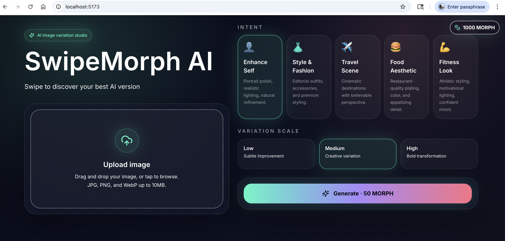
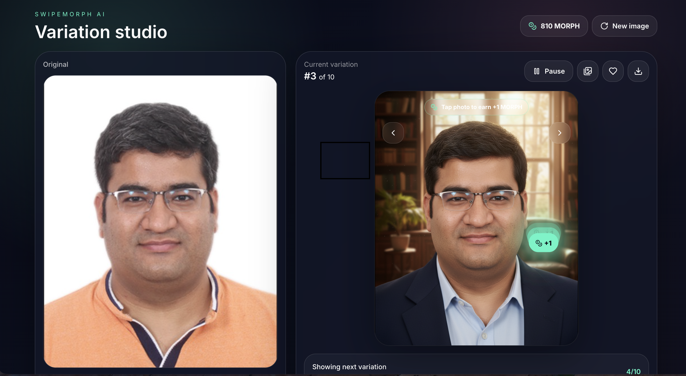

# SwipeMorph AI

SwipeMorph AI is a full-stack MVP for AI image variations. Users upload an image, choose a transformation intent and variation scale, generate the first result, and then the app continuously prepares the next variation in the background. When the next result is ready, the card auto-swipes to the new image.

## Product Preview

### Home



### Variation Studio



## Stack

- Frontend: React, Vite, Tailwind CSS, Framer Motion
- Backend: Python FastAPI
- Cloud: Google Cloud Run, Cloud Storage, Vertex AI Gemini image model
- Default Vertex model: `gemini-2.5-flash-image`

## Folder Structure

```text
frontend/          React + Vite app
backend/           FastAPI app, Dockerfile, requirements
docs/images/       Product screenshots for README and project overview
.env.example       Shared environment variable reference
```

## Local Frontend Setup

```bash
cd frontend
npm install
cp ../.env.example .env
npm run dev
```

Open `http://localhost:5173`.

Set `VITE_API_BASE_URL` in `frontend/.env` if your backend runs somewhere else.

## Local Backend Setup

```bash
cd backend
python -m venv .venv
source .venv/bin/activate
pip install -r requirements.txt
cp ../.env.example .env
uvicorn app.main:app --reload --port 8080
```

By default, the backend uses real Vertex AI generation. For local testing with Vertex AI, set at minimum:

```bash
GOOGLE_CLOUD_PROJECT=YOUR_PROJECT_ID
GOOGLE_CLOUD_LOCATION=us-central1
VERTEX_IMAGE_MODEL=gemini-2.5-flash-image
MOCK_VERTEX_IMAGES=false
```

If `GCS_BUCKET_NAME` is empty, uploads and generated results are stored locally under `LOCAL_STORAGE_DIR` and served from `/local/...`. Set `GCS_BUCKET_NAME` when you want Cloud Storage.

For a UI-only demo without Vertex AI, explicitly set:

```bash
MOCK_VERTEX_IMAGES=true
```

## Required Google Cloud APIs

Enable these APIs:

```bash
gcloud services enable run.googleapis.com storage.googleapis.com aiplatform.googleapis.com cloudbuild.googleapis.com
```

## Environment Variables

| Name | Description |
| --- | --- |
| `GOOGLE_CLOUD_PROJECT` | Google Cloud project ID |
| `GOOGLE_CLOUD_LOCATION` | Vertex AI region, for example `us-central1` |
| `GCS_BUCKET_NAME` | Bucket for `uploads/` and `results/` objects |
| `VERTEX_IMAGE_MODEL` | Gemini image model, defaults to `gemini-2.5-flash-image` |
| `CORS_ALLOWED_ORIGINS` | Comma-separated allowed frontend origins |
| `SIGNED_URL_EXPIRATION_MINUTES` | Signed URL lifetime for private buckets |
| `GCS_USE_PUBLIC_URLS` | Return public Cloud Storage URLs instead of signed URLs |
| `MOCK_VERTEX_IMAGES` | Use local preview effects instead of Vertex AI; keep `false` for real generation |
| `BACKEND_PUBLIC_URL` | Public backend URL used for locally served files |
| `LOCAL_STORAGE_DIR` | Local upload/result directory used when `GCS_BUCKET_NAME` is empty |
| `VITE_API_BASE_URL` | Frontend API base URL |

## Cloud Storage Bucket Setup

```bash
gcloud storage buckets create gs://YOUR_BUCKET_NAME --location=us-central1
```

The app writes uploaded images to:

```text
gs://YOUR_BUCKET_NAME/uploads/
```

Generated images are written to:

```text
gs://YOUR_BUCKET_NAME/results/
```

For private buckets, keep `GCS_USE_PUBLIC_URLS=false` and the backend will return signed URLs. For a public demo bucket, configure object access intentionally and set `GCS_USE_PUBLIC_URLS=true`.

## Vertex AI Setup

Use Application Default Credentials locally:

```bash
gcloud auth application-default login
gcloud config set project YOUR_PROJECT_ID
```

The backend uses the Google Gen AI SDK with Vertex AI:

```text
model=gemini-2.5-flash-image
```

Prompt orchestration is handled in `backend/app/prompts.py`. The backend first asks Gemini to analyze the uploaded image, then uses the analysis plus category and scale rules to generate a variation.

## Cloud Run Deployment

Build and deploy the backend from the repository root:

```bash
gcloud run deploy swipemorph-api \
  --source backend \
  --region us-central1 \
  --allow-unauthenticated \
  --set-env-vars GOOGLE_CLOUD_PROJECT=YOUR_PROJECT_ID,GOOGLE_CLOUD_LOCATION=us-central1,GCS_BUCKET_NAME=YOUR_BUCKET_NAME,VERTEX_IMAGE_MODEL=gemini-2.5-flash-image,CORS_ALLOWED_ORIGINS=https://YOUR_FRONTEND_ORIGIN
```

Grant the Cloud Run service account access to Cloud Storage and Vertex AI:

```bash
gcloud projects add-iam-policy-binding YOUR_PROJECT_ID \
  --member="serviceAccount:YOUR_SERVICE_ACCOUNT" \
  --role="roles/storage.objectAdmin"

gcloud projects add-iam-policy-binding YOUR_PROJECT_ID \
  --member="serviceAccount:YOUR_SERVICE_ACCOUNT" \
  --role="roles/aiplatform.user"
```

Deploy the frontend to your preferred static hosting provider after building:

```bash
cd frontend
npm run build
```

Set `VITE_API_BASE_URL` to the Cloud Run backend URL before building.

## API

### `GET /api/health`

```json
{ "status": "ok" }
```

### `POST /api/upload`

Multipart field: `file`

```json
{
  "imageUrl": "...",
  "fileName": "uploads/...",
  "status": "uploaded"
}
```

### `POST /api/generate-first-variation`

```json
{
  "originalImageUrl": "...",
  "category": "enhance_self",
  "variationScale": "medium"
}
```

### `POST /api/generate-next-variation`

```json
{
  "originalImageUrl": "...",
  "currentImageUrl": "...",
  "category": "enhance_self",
  "variationScale": "medium",
  "variationIndex": 2
}
```

## Security Notes

- No Google Cloud credentials or API keys are exposed to the frontend.
- Use Application Default Credentials locally.
- Use a Cloud Run service account in production.
- Keep the bucket private unless you intentionally choose public URLs.
- Upload validation rejects unsupported file types and files larger than 10MB.
- Restrict `CORS_ALLOWED_ORIGINS` to your deployed frontend origin in production.
